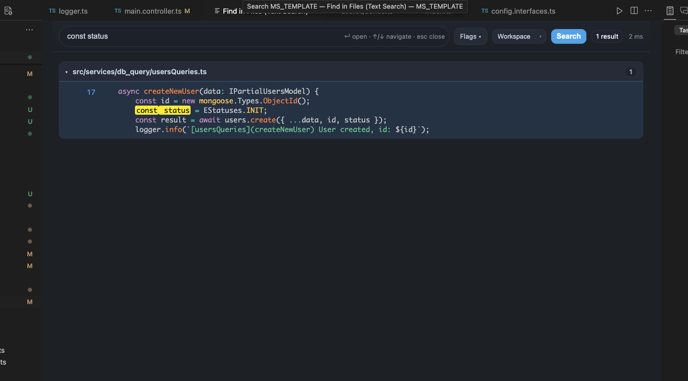
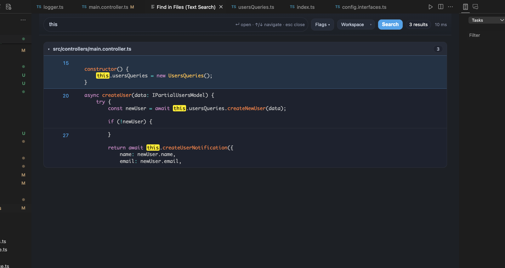
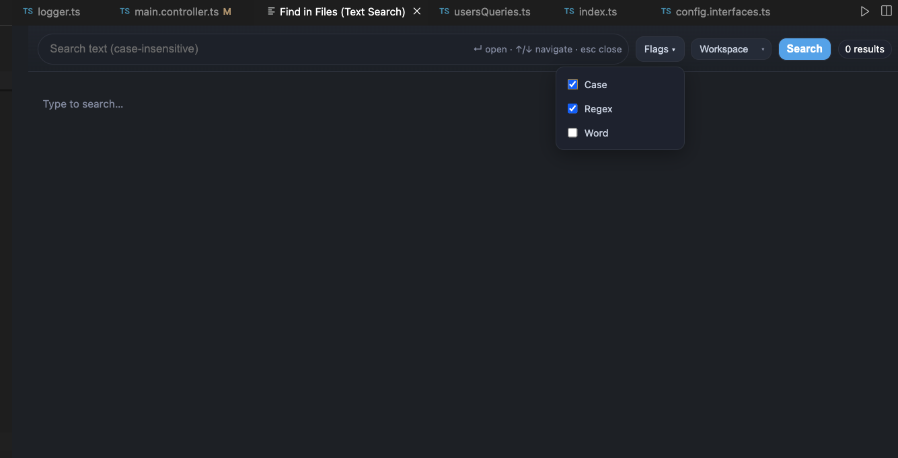

# 🔍 Search Everywhere Lite

Fast, minimalistic text search for VS Code & Cursor.  
🚀 Born from the need to move from JetBrains IDEs (like WebStorm) to VS Code/Cursor — this is the perfect “Search Everywhere”-style solution you’ve been missing.

**Last updated:** August 10, 2025

---

## Why this extension?

JetBrains IDEs have an amazing **Search Everywhere** feature that’s quick, smart, and shows results with context.  
When switching to VS Code or Cursor, I couldn’t find anything that felt the same — so I built it.  
Now you can enjoy lightning-fast, keyboard-driven search without leaving your flow.

---

## ✨ Features

- 🔍 **Fuzzy search** across files (case-insensitive)
- ⚡ **Instant results** with highlighted matches
- 📁 **MRU ordering** (Most Recently Used first)
- 🧠 **Context preview** around each match
- 🌐 **Custom WebView** with Prism.js syntax highlighting
- 🎯 **Keyboard navigation** (`Enter`, `↑/↓`, `Esc`)

---

## 🚀 Usage

1. Press `Cmd+Shift+A` (macOS) or `Ctrl+Shift+A` (Windows/Linux)
2. Type your query
3. Navigate with arrow keys, press **Enter** to open

✅ **Lightweight** – zero config  
💡 **Perfect for large monorepos**  
🌈 Built with TypeScript, Prism.js, and WebView magic

---

## Screenshots

  
*Single result*

  
*Multiple results*
*Syntax-highlighted matches with `<mark>` highlighting and context*

  
*flags use for search*

---

## 🛠 Development (for contributors)

```bash
pnpm install
pnpm run compile
pnpm exec vsce package
