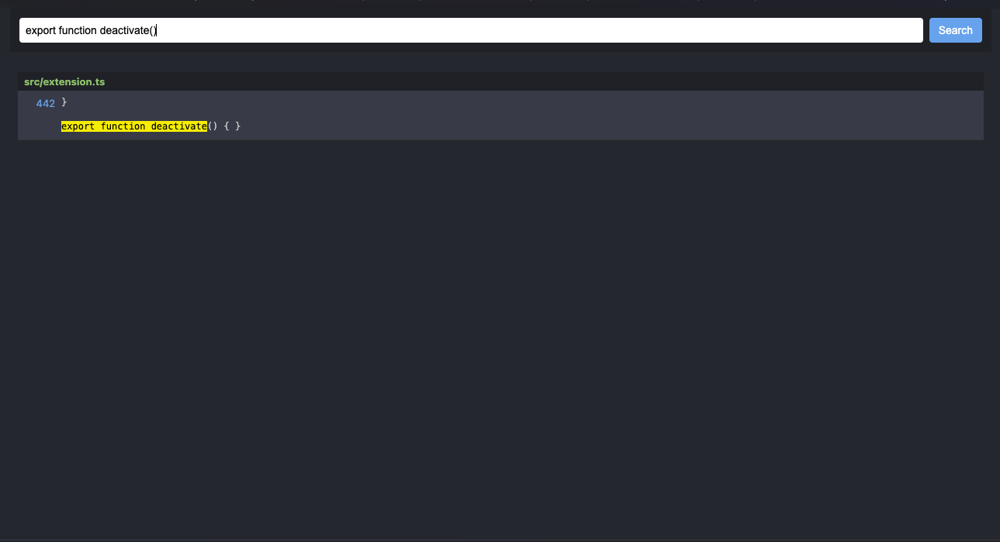
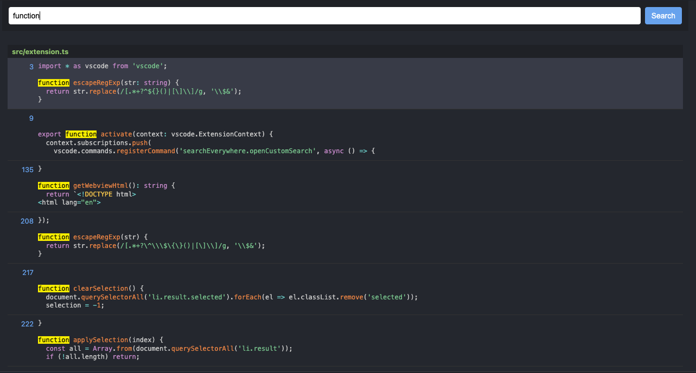

# 🔍 Search Everywhere Lite

Fast, minimalistic, text-based search for VS Code.  
🚀 Inspired by WebStorm's "Search Everywhere" — with MRU (Most Recently Used) ranking, contextual preview, and fuzzy matching.

## Features

- 🔍 Fuzzy search across files (case-insensitive)
- ⚡ Instant result rendering with highlighted matches
- 📁 MRU-style result ordering
- 🧠 Context preview around each match
- 🌐 Custom WebView panel with Prism.js syntax highlighting
- 🎯 Keyboard navigation (`Enter`, `ArrowUp/Down`, `Esc`)

## Screenshots

📸 Click to view screenshots

 

  
*Clean, keyboard-first search UI*

  
*Syntax-highlighted matches with `<mark>` highlighting and context*

## Getting Started

### Install
- Clone or download this repo
- Run `pnpm install`
- Run `pnpm run compile`
- Package: `pnpm exec vsce package`
- Install the `.vsix` file in VS Code (`Extensions` > `...` > `Install from VSIX`)

## 🚀 Usage

1. Press `Cmd+Shift+a` / `Ctrl+Shift+a`
2. Type your query and navigate with arrow keys + Enter

## 🧠 Author

Made by **Maor Levinshtein - MaorLv52**  
Local version not published to the Marketplace (yet).

---

✅ Lightweight – zero config  
💡 Ideal for large monorepos  
🌈 Built with TypeScript, Prism.js, and WebView magic
